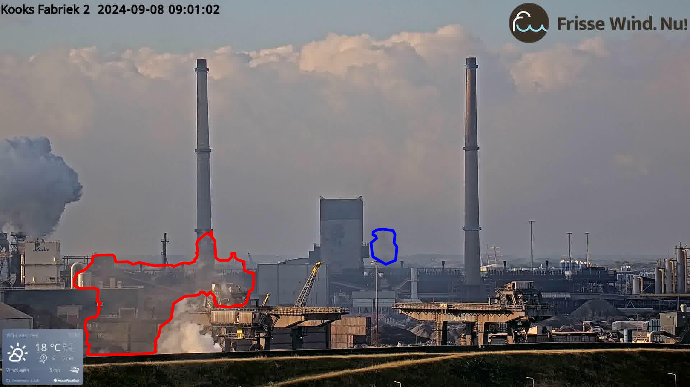

  <h1>CEDANet: Citizen-engaged Domain Adaptation Net</h1>
  
<em>Bridging Synthetic and Real-World Domains: A Human-in-the-Loop Weakly-Supervised Framework for Industrial Toxic Emission Segmentation</em>

## Overview

Modern environmental monitoring systems face two core challenges when deployed in industrial settings:  
1. **Domain Gap**: Public datasets (e.g., SMOKE5K) are collected under controlled or wildfire conditions, which differ in color, texture, and transparency from industrial toxic clouds.  
2. **Annotation Scalability**: Pixel-level expert annotation is expensive and time-consuming, making it impractical at scale.  

We present CEDANet (Citizen-engaged Domain Adaptation Net), a novel framework that advances domain adaptation from image-level to pixel-level class-aware learning while integrating citizen science for enhanced pseudo-label generation. This work represents the first comprehensive system combining these methodologies for industrial smoke detection applications.

## The Challenge

Environmental monitoring systems face multiple interconnected challenges when transitioning from research environments to real-world applications:

1. **Domain Gap**: Laboratory datasets with controlled conditions differ significantly from complex industrial environments
2. **Annotation Scalability**: Traditional expert-based annotation is costly and time-consuming for large-scale deployment
3. **Spatial Precision**: Moving from image-level classification to pixel-level detection requires more sophisticated learning approaches

While laboratory conditions provide controlled datasets with abundant annotations, real-world scenarios often suffer from limited labeled data, significant distribution shifts, and the need for precise spatial localization of environmental hazards.

  
  
  
<strong>Figure 1:</strong> Real-world industrial monitoring scenarios (Target Domain - IJmond Factory, Source: https://ijmondcam.multix.io/)

The challenge becomes even more apparent when considering the annotation and data preparation process for target domain applications. Manual annotation of smoke regions and intelligent cropping strategies are essential for creating effective training datasets from real-world monitoring scenarios.

  
  
  
<strong>Figure 1b:</strong> Target domain annotation and cropping examples - Left: Manual smoke region annotation; Right: We crop these images for enhanced detection

The disparity becomes evident when comparing controlled research datasets with actual industrial monitoring conditions. Public datasets, while rich in annotations, may not capture the complexity and variability of real-world environments.

  
  
  
<strong>Figure 2:</strong> Research dataset examples (Source Domain - SMOKE5K Dataset, Source: https://github.com/SiyuanYan1/Transmission-BVM)

## Our Approach: CEDANet

CEDANet represents a significant advancement in domain adaptation for computer vision, specifically targeting industrial smoke detection. Our approach introduces three key innovations that work synergistically to address the challenges of real-world environmental monitoring.

**Key Technical Innovations:**

1. **Pixel-Level Class-Aware Domain Adaptation**: We extend traditional image-level weakly supervised domain adaptation to pixel-level pseudo-labeling with class-aware mechanisms. This advancement enables more precise spatial localization of smoke regions while maintaining robust cross-domain knowledge transfer.

2. **Citizen Science Integration**: We pioneer the integration of citizen science methodologies into the domain adaptation framework. Citizens participate directly in both pseudo-label generation and refinement processes, creating a human-in-the-loop system that enhances annotation quality and scalability. In our implementation, citizen volunteers are presented with video frames and provide binary labels (smoke/no-smoke) to support the learning process.

3. **Unified System for Industrial Applications**: For the first time, we present a comprehensive system that organically combines pixel-level domain adaptation with citizen engagement, specifically designed and validated for industrial smoke detection tasks. This represents the first application of such integrated methodology to environmental monitoring scenarios.

**Methodological Framework:**

Our system operates through an integrated pipeline that seamlessly combines technical advancement with human intelligence:

- **Enhanced Domain Adaptation**: Progression from traditional image-level weak supervision to sophisticated pixel-level class-aware pseudo-labeling
- **Citizen Science Pipeline**: Systematic integration of community participation in annotation workflows, including both initial pseudo-label generation and iterative refinement processes  
- **Industrial Application Focus**: Comprehensive system design specifically tailored for the complexities of industrial smoke detection, representing the first such application in environmental monitoring

**Research Contributions:**

This work makes several significant contributions to the field:
- **Technical**: First extension of image-level weakly supervised domain adaptation to pixel-level class-aware frameworks
- **Methodological**: Pioneer integration of citizen science in domain adaptation pipelines
- **Applied**: First comprehensive system combining these approaches for industrial smoke monitoring

## Citizen Science Data Collection

Our citizen science approach leverages community engagement for scalable annotation. Volunteers are presented with video frames from various sources and provide simple binary classifications to support the domain adaptation process.

  
  
  
<strong>Figure 3:</strong> Examples of video frames presented to citizen volunteers for binary smoke/no-smoke labeling (cropped from surveillance camera footage)

## Impact and Applications

This research contributes to several critical areas:

- **Environmental Monitoring**: Enhanced detection capabilities for industrial emissions
- **Public Health**: Improved air quality assessment through automated monitoring
- **Industrial Safety**: Real-time hazard detection and early warning systems
- **Community Engagement**: Democratizing environmental monitoring through citizen participation

## Acknowledgements

This project was completed as a Master thesis under the supervision of Professor Yen-Chia Hsu at the University of Amsterdam. Special thanks to the local volunteers in IJmond for their invaluable contributions to the dataset.

## References

- [SMOKE5K Dataset: Transmission-BVM](https://github.com/SiyuanYan1/Transmission-BVM)
- [IJmondCam Industrial Monitoring](https://ijmondcam.multix.io/)
- [IJmond-camera-ai](https://github.com/MultiX-Amsterdam/ijmond-camera-ai)

**This Readme file was generated by AI tools and edited by the author, which may still contain inaccuracies. Please refer to the original research paper for detailed information.**